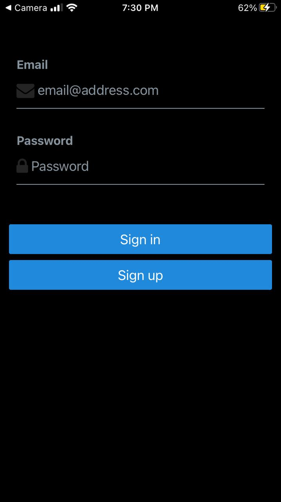

# Email and Password Authentication

### What I have done 

```bash
async function signUpWithEmail() {
    setLoading(true)
    const {
      data: { session },
      error,
    } = await supabase.auth.signUp({
      email: email,
      password: password,
    })

    if (error) Alert.alert(error.message)
    if (!session) Alert.alert('Please check your inbox for email verification!')
    setLoading(false)
  }
```
The above function handles new user registration by capturing email and password inputs and sending the credentials to the supabase authentication service. After the sign up it automatically sends a confirmation email to the email address provided. If there is any server error and successful signing up, it includes error handling and user feedback mechanisms.


```bash
async function signInWithEmail() {
    setLoading(true)
    const { error } = await supabase.auth.signInWithPassword({
      email: email,
      password: password,
    })

    if (error) Alert.alert(error.message)
    setLoading(false)
  }
```
The above function handles authentication by validating credentials against the supabase authentication service and providing appropriate feedback. 


```bash
return (
    <View style={styles.container}>
      <View style={[styles.verticallySpaced, styles.mt20]}>
        <Input
          label="Email"
          leftIcon={{ type: 'font-awesome', name: 'envelope' }}
          onChangeText={(text) => setEmail(text)}
          value={email}
          placeholder="email@address.com"
          autoCapitalize={'none'}
        />
      </View>
      <View style={styles.verticallySpaced}>
        <Input
          label="Password"
          leftIcon={{ type: 'font-awesome', name: 'lock' }}
          onChangeText={(text) => setPassword(text)}
          value={password}
          secureTextEntry={true}
          placeholder="Password"
          autoCapitalize={'none'}
        />
```
The UI components provide clear input fields with appropriate labeling, icons for visual cues, and security features like hidden password entry.



### What I have learned

During the implementation of email and password authentication with Supabase, 

I've learned:

1. How to integrate Supabase authentication services with React Native applications
2. The proper methods for handling user credentials securely
3. How to implement sign-up functionality using the supabase
4. How email verification works within authentication flows

## What challenges I have faced

Throughout the development process, I encountered several challenges:

1. Understanding the Supabase authentication API and its implementation requirements
2. Managing asynchronous operations during the authentication process
3. Handling and displaying appropriate error messages from the authentication server
4. Implementing secure password management without exposing sensitive information
5. Ensuring proper email validation and verification processes
6. Creating a responsive and user-friendly interface for the authentication 

## How did I overcome

To overcome the challenges faced during development:

1. I studied the Supabase documentation to understand the authentication API properly
2. Implemented async/await patterns with proper error handling to manage asynchronous operations
