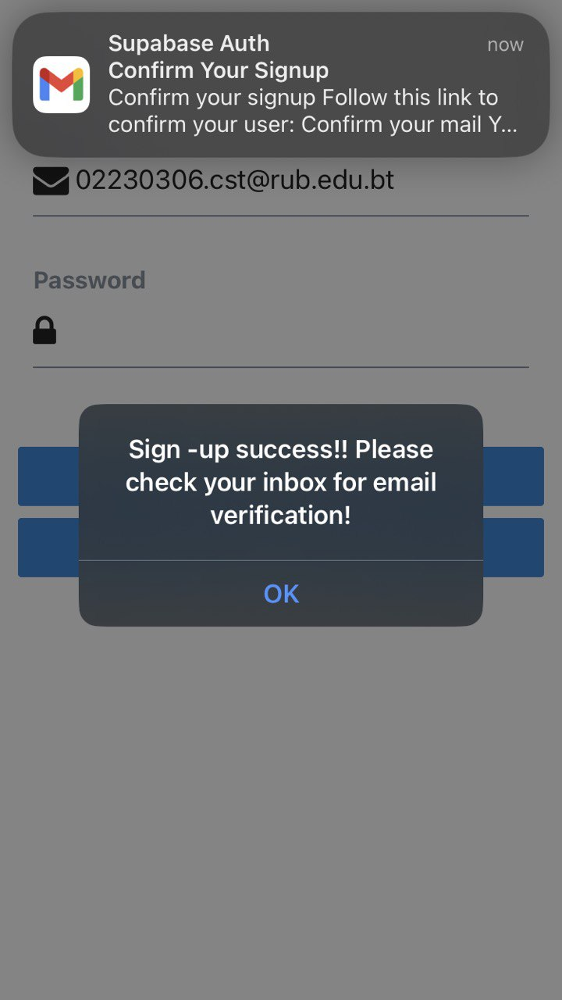

# Magiclink Authentication

### What I have done

```bash
const redirectUrl =
  process.env.NODE_ENV === 'production'
    ? 'https://dontmakemeangary.netlify.app/'
    : 'http://localhost:3000';

  async function signInWithEmail() {
    // setLoading(true)
    const { data, error } = await supabase.auth.signInWithOtp({
      email: email,
      options: {
        emailRedirectTo: redirectUrl,
      }
    //   password: password,
        
    })

    if (error) Alert.alert(error.message)
    setLoading(false)
  }
  ```
In the above, I defined the based on the environment as below : 
1. If the app is running on the production, the redirect URL is set to https://dontmakemeangry.netlify.app/

2. If the app is running in development, the redirect URL is set to localhost:3000.




For that since I am developing the app, I set the redirectURL to localhost.

The function handles the magic link sign in process, where the magic link is send to the user's email for authentication.

The main implementation of magic link is to redirect the user to the redirectURL after clicking the link sent to the user's email. The user can log in by clicking a link sent to their email. Therefore eliminating the need for passwords, that enhance both security and user experince. 


### What I have learned

1. Magic link authentication is a passwordless login method where users receive a link in their email to authenticate themselves. This eliminates the need for remembering passwords, enhancing both security and user experience.
Environment-Based Redirect URLs

2. I learned how to dynamically set the redirect URL based on the environment in production, the redirect URL points to the live application (https://dontmakemeangary.netlify.app/).

3. In development, the redirect URL points to the local server (http://localhost:3000).
This ensures that the authentication flow works seamlessly in both development and production environments.
4. Using Supabase's signInWithOtp method I explored how to use Supabase's auth.signInWithOtp method to send a magic link to the user's email for authentication.

5. I learned how to configure the emailRedirectTo option to specify where the user should be redirected after clicking the magic link.

### What challenges I have faced

1. Understanding the Supabase authentication API and its implementation requirements
2. Managing asynchronous operations during the authentication process
3. Handling and displaying appropriate error messages from the authentication server
4. Implementing secure password management without exposing sensitive information
5. Ensuring proper email validation and verification processes

## How did I overcome

To overcome the challenges faced during development:

1. I studied the Supabase documentation to understand the authentication API properly
2. Implemented async/await patterns with proper error handling to manage asynchronous operations
